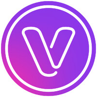

# Hello World

I am Erik 👋… I am a Software Engineer with a Bachelor's degree in Information Systems and 6+ years of experience designing, developing, and optimizing web applications using Angular (versions 2 through 18), React, Next, and TypeScript. Proficient in Node.js to build RESTful APIs using Express.js, PostgreSQL, MongoDB, Docker, and Docker Compose, including setup of AWS services CodePipeline, CodeBuild, CodeDeploy, CodeCommit, WAF, CloudFront, S3, RDS, EC2, Route 53, ACM, and ELB.

Proven ability to collaborate with cross-functional teams to deliver high-quality user interfaces that meet WCAG accessibility standards, enhancing search engine ranking. In addition to advanced English proficiency and experience leading technical meetings besides integration discussions.

## Skillset

## About me

- 🌱 I’m currently interested in learning more about **AWS, Terraform, and Next.js**
- 👨‍💻 Take a look at [indianboy.com.br](https://indianboy.com.br)
- 📝 I regularly write articles on [DEV.to](https://dev.to/theer1k)
- 💬 Ask me about **software engineering or frontend technologies**
- 📄 Know more about my experiences on [LinkedIn](https://www.linkedin.com/in/erikhenriquealvescunha/)
- ⚡ Fun fact **I am not from India** 🇮🇳

## GitHub stats

    

## Blogs posts

<!-- BLOG-POST-LIST:START -->

<!-- BLOG-POST-LIST:END -->

 

## Work experience

**Frontend Developer** \
[**Canon Medical Systems (Brazil)**](https://br.medical.canon/) • Contract \
**Technologies**: `Angular v12~v16` \
**Projects**: Internal

**Software Engineer** \
[**Grupo SBF**](https://ri.gruposbf.com.br/) • Full-time \
**Technologies**: `React.js v18+`, `Next.js v12` \
**Projects**: [Nike](https://www.nike.com.br/), and [Centauro](https://www.centauro.com.br/)

**Frontend Developer** \
[**Encora Inc. (Brazil)**](https://www.encora.com/) • Full-time \
**Technologies**: `Angular v8~v12`, `AWS` \
**Projects**: [VMWare Pathfinder](https://pathfinder.vmware.com/)

**Frontend Developer** \
[**Zup Innovation (Itaú Bank)**](https://www.zup.com.br/) • Full-time \
**Technologies**: `Angular v11`, `AWS (CI/CD)` \
**Projects**: Internal

**Full Stack Developer (MEAN Stack)** \
[**Venturus**](https://www.venturus.org.br/) • Full-time \
**Technologies**: `Angular v4~11`, `Node.js` \
**Projects**: [CGO (Comex)](http://www.cgoassessoria.com.br/), [CCR Autoban](https://www.autoban.com.br/)

**Full Stack Developer** \
[**MB Labs**](https://mblabs.com.br/) • Contract \
**Technologies**: `Angular/Ionic v3`, `Node.js` \
**Projects**: SM Aprendizagem (Edições SM), and Hondana

## Connect with me

